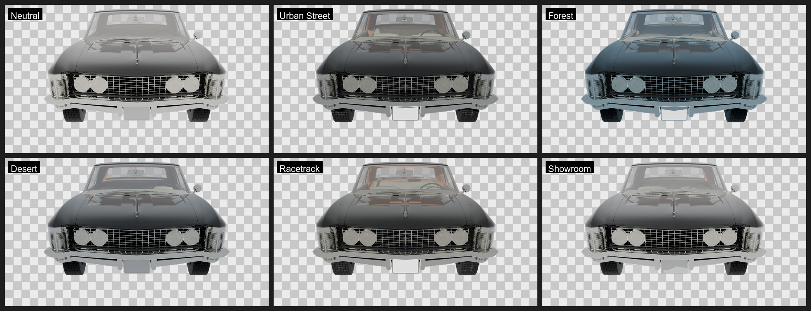
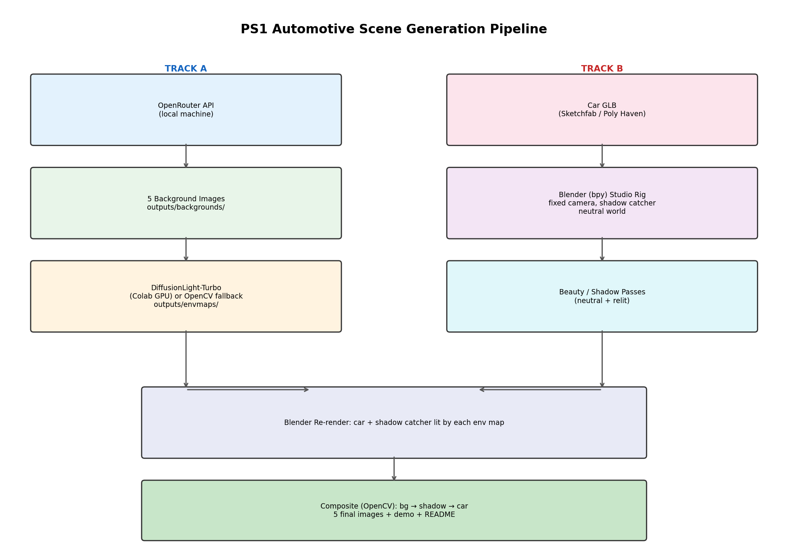

# PS1 — Automotive Scene Generation Pipeline

> Generate photorealistic images of a fixed 3D car model composited into GenAI-produced backgrounds, with per-scene adaptive lighting.

## Result



## Architecture



```
 TRACK A (no car needed — do first)         TRACK B (needs car — do when available)
 ┌──────────────────────────┐               ┌──────────────────────────┐
 │ OpenRouter API             │               │ Car GLB (Sketchfab/       │
 │ (local machine)            │               │ Poly Haven)                │
 └────────────┬───────────────┘               └────────────┬───────────────┘
              │ Seedream 4.5 / FLUX                        │
              ▼                                             ▼
 ┌──────────────────────────┐               ┌──────────────────────────┐
 │ 5 background images        │               │ Blender (bpy) studio rig  │
 │ outputs/backgrounds/       │               │ fixed camera, shadow      │
 └────────────┬───────────────┘               │ catcher, neutral world    │
              │                                └────────────┬───────────────┘
              ▼                                             │ beauty / shadow
 ┌──────────────────────────┐                              │ passes (neutral)
 │ DiffusionLight-Turbo        │                              │
 │ (Colab GPU) or OpenCV       │                              │
 │ fallback → env maps         │                              │
 │ outputs/envmaps/            │                              │
 └────────────┬───────────────┘                              │
              │                                               │
              └───────────────────┬───────────────────────────┘
                                  ▼
                     ┌──────────────────────────┐
                     │ Blender re-render:          │
                     │ car + shadow catcher lit     │
                     │ by each env map              │
                     └────────────┬───────────────┘
                                  ▼
                     ┌──────────────────────────┐
                     │ Composite (OpenCV)          │
                     │ bg → shadow → car            │
                     └────────────┬───────────────┘
                                  ▼
                        5 final images + demo + README
```

## Project Structure

```
ps1-car-pipeline/
├── README.md
├── requirements.txt
├── config.yaml
├── assets/                 # place car.glb here
├── scripts/
│   ├── 01_studio_rig.py         # Blender studio rig (Track B)
│   ├── 02_generate_backgrounds.py   # OpenRouter background gen (Track A)
│   ├── 03_lighting_estimation.py    # OpenCV fallback / DiffusionLight wrapper (Track A)
│   ├── 04_relight_render.py     # Blender relight per env (Track B)
│   ├── 05_composite.py          # OpenCV compositing (Track B)
│   ├── 06_polish.py             # FFmpeg unsharp mask & grading (Track B)
│   ├── 07_contact_sheet.py      # Generates review grids (Track B)
│   ├── 08_last_polish.py        # Ambient color bleed blending (Track B)
│   └── run_pipeline.py          # Orchestration
├── notebooks/
│   └── colab_pipeline.ipynb     # DiffusionLight-Turbo on Colab
└── outputs/
    ├── backgrounds/         # 5 GenAI backgrounds
    ├── envmaps/             # HDRI env maps OR fallback_lighting.json
    ├── car_passes/          # Beauty + shadow renders
    ├── final/               # 5 composited final images
    ├── final_polished/      # Graded and polished final images
    └── demo/                # Demo video / screenshots
```

## Quick Start

### Prerequisites

- Python 3.10+
- Blender 3.6+ (with Cycles)
- FFmpeg (must be in system PATH for `06_polish.py`)
- OpenRouter API key (for background generation)
- (Optional) Google Colab account (for DiffusionLight-Turbo GPU inference)

### Install

```bash
cd ps1-car-pipeline
pip install -r requirements.txt
```

### Track A — Run Immediately (No Car Required)

```bash
# 1. Set your OpenRouter key
export OPENROUTER_API_KEY="sk-or-v1-..."

# 2. Generate 5 backgrounds
python scripts/02_generate_backgrounds.py

# 3. Estimate lighting (OpenCV fallback — fast, local, zero setup)
python scripts/03_lighting_estimation.py --mode opencv
```

**Checkpoint:** `outputs/backgrounds/` has 5 PNGs, `outputs/envmaps/` has `fallback_lighting.json`.

### Track B — Run Once You Have the Car

1. Download a CC-licensed car GLB from [Sketchfab](https://sketchfab.com) or [Poly Haven](https://polyhaven.com).
2. Place it at `assets/car.glb`.
3. Fill in `car.bounding_box` in `config.yaml` (optional — scripts compute it automatically).

```bash
# 4. Studio rig + neutral sanity render
blender --background --python scripts/01_studio_rig.py

# 5. Relight under each environment
blender --background --python scripts/04_relight_render.py

# 6. Composite final images
python scripts/05_composite.py

# 7. Apply Post-Processing & Grading (FFmpeg + Ambient Bleed)
python scripts/06_polish.py
python scripts/08_last_polish.py

# 8. Generate Contact Sheet
python scripts/07_contact_sheet.py

# Or simply run the full pipeline:
python scripts/run_pipeline.py --track all
```

**Checkpoint:** `outputs/final_polished/` has 5 beautifully graded images, and `outputs/beauty_contact_sheet.png` is ready for review.

### Alternative: DiffusionLight-Turbo on Colab

If you want higher-fidelity environment maps instead of the OpenCV fallback:

1. Upload `outputs/backgrounds/` to your Google Drive.
2. Open `notebooks/colab_pipeline.ipynb` in Google Colab.
3. Run all cells.
4. Download the resulting env maps back to `outputs/envmaps/`.
5. Re-run `04_relight_render.py` — it will auto-detect the HDRI files.

**Hard stop rule:** If DiffusionLight-Turbo does not produce usable env maps within 90 minutes, switch back to the OpenCV fallback and move on.

## Pipeline Stages

| Stage | Script | Track | Cost |
|---|---|---|---|
| Background generation | `02_generate_backgrounds.py` | A | ~$0.04–$0.20/image (OpenRouter) or $0 manual/local model|
| Lighting estimation | `03_lighting_estimation.py` | A | $0 (OpenCV) or $0 (Colab GPU) |
| Studio rig | `01_studio_rig.py` | B | $0 |
| Relight render | `04_relight_render.py` | B | $0 |
| Composite | `05_composite.py` | B | $0 |
| Polish (Unsharp/Color) | `06_polish.py` | B | $0 |
| Ambient Bleed | `08_last_polish.py` | B | $0 |
| Contact Sheet | `07_contact_sheet.py` | B | $0 |

**Total cost:** ~$0.20–$1.00 for the entire project (background generation only).

## Constraints Honored

- **Car untouched:** The car GLB is imported as-is. No geometry, material, or proportion edits are made.
- **Background 100% GenAI:** All 5 environments are generated via OpenRouter image models (Seedream 4.5 / FLUX).
- **Lighting adapts per-scene:** Each background drives its own lighting setup — either via DiffusionLight-Turbo env map or OpenCV-derived sun direction + ambient tint.

## Known Limitations

1. **Fixed camera:** Single camera angle across all environments. No per-shot perspective variation.
2. **OpenCV fallback fidelity:** The fallback uses a single dominant light direction + ambient color. It does not produce true environmental reflections (no HDRI).
3. **No ground contact refinement:** The shadow catcher is a flat plane. Complex ground geometry (curbs, dunes) is not modeled.
4. **Car asset dependency:** Track B is fully blocked until a GLB is sourced.

## Cost / Infra Summary

| Resource | Purpose | Cost |
|---|---|---|
| OpenRouter (Seedream 4.5) | 5 background images | ~$0.20–$1.00 |
| Google Colab (free T4) | DiffusionLight-Turbo + Blender render | $0 |
| Local machine | Background gen API calls, OpenCV, orchestration | $0 |

## Troubleshooting

| Problem | Fix |
|---|---|
| `OPENROUTER_API_KEY` not set | Export the env var before running Track A |
| Blender not found | Install Blender and ensure `blender` is in your PATH |
| DiffusionLight-Turbo fails on Colab | Interrupt after 90 min, use OpenCV fallback (`--mode opencv`) |
| Car import looks broken | Swap the GLB asset — do not attempt to repair (violates no-edit constraint) |
| Hard edges on composite | Re-run `05_composite.py` without `--no-feather` (feathering is on by default) |
| Shadow direction looks wrong | Check `fallback_lighting.json` azimuth/elevation values against the background's implied sun position |

## Hard Stop Rules

| Checkpoint | Rule |
|---|---|
| Background gen | Validate ONE prompt in OpenRouter playground before batching all 5 |
| Lighting estimation | 1.5 hrs max on DiffusionLight → OpenCV fallback, no further debugging |
| Car import | Import fails or looks broken → swap car model, don't debug a broken asset |
| Composite | All 5 visually acceptable → move to demo/README, stop polishing pixels |

## License

This pipeline scaffold is provided as a build artifact. Car assets and generated backgrounds retain their original licenses.
